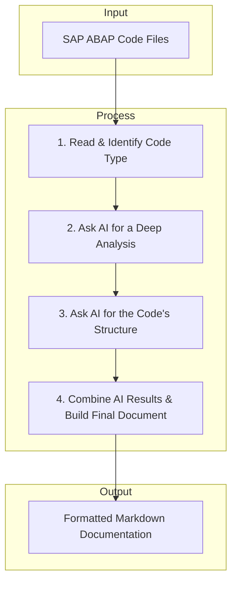

# AI-Powered ABAP Code Documentation Generator

[](https://www.python.org/downloads/)
[](https://opensource.org/licenses/MIT)
[](https://github.com/astral-sh/ruff)

An intelligent command-line tool that leverages Large Language Models (LLMs) to automatically analyze SAP ABAP source code and generate comprehensive technical documentation. This project automates the tedious process of documenting legacy and modern ABAP objects, ensuring consistency and saving valuable developer time.

## ✨ Features

- **Multi-Object Analysis**: Supports a wide range of ABAP objects, including Classes, Reports, Function Modules, Database Tables, and modern RAP artifacts.
- **Deep Code Insight**: Generates a detailed breakdown of code, including logic, data interaction, dependencies, and code quality assessments.
- **Structured Output**: Produces a clear structural overview of each object, such as method signatures for classes or field definitions for tables.
- **Technical Specification Synthesis**: Intelligently combines the code analysis and structure into a formal Technical Specification document.
- **LLM Integration**: Powered by local LLMs through [Ollama](https://ollama.com/library) for privacy and control.
- **Extensible Prompting**: Uses a modular, template-based approach for prompts, making it easy to customize or add support for new object types.

## 💡 A Note on the AI and Project Scope

This project is primarily an educational tool designed for SAP Technical Consultants who are venturing into AI-powered application development using Python. It serves as a practical starting point and a showcase of what's possible.

Please keep the following in mind:

- **Use of Open-Source LLMs**: The tool is configured to use free and open-source Large Language Models (LLMs) through Ollama. This makes the project accessible and easy to run locally.
- **General-Purpose Models**: The default LLMs are powerful general-purpose models, but they have **not** been specifically fine-tuned on ABAP or SAP-related source code. Their analysis is based on general coding pattern recognition.
- **Achieving Better Results**: For more accurate and context-aware documentation, especially for complex or modern ABAP like RAP, CAP, EML, ABAP 7.4. etc, you can adapt the code to use commercial LLM APIs (e.g., from OpenAI, Google, Anthropic). These models often have broader training data and may yield superior results.
- **A Foundation for Learning**: Consider this project a foundation. You are encouraged to experiment with different models, refine the prompts, and expand its capabilities as you deepen your understanding of AI in the SAP ecosystem.

## 🚀 Project Flow

Here’s a simple breakdown of how the application works from start to finish.

### Simple Flow Diagram



### Step-by-Step Process

1.  **Initialize Components**: Instantiate the core components: `Ollama`, `Document_Splitter`, `PromptGenerator`, and `CreateDocument`.
2.  **Load and Split Documents**: Load all `.abap` files from the target directory, identify the object type for each, and split them into manageable chunks.
3.  **Generate Initial Prompts**: Create tailored prompts for each document to get a detailed `analysis` and a `structural` breakdown from the AI.
4.  **First AI Interaction (Analysis & Structure)**: Send the code chunks and corresponding prompts to the Ollama model. The AI's responses are parsed and stored.
5.  **Generate Specification Prompt**: Synthesize the results from the analysis and structure steps to create a new, comprehensive prompt for generating a formal Technical Specification.
6.  **Second AI Interaction (Specification)**: Send the synthesized information and the new prompt to the Ollama model to generate the final specification content.
7.  **Assemble Final Document**: Combine the analysis, structure, and technical specification for all processed files into a single, well-formatted Markdown report.

## 🛠️ Tech Stack

- **Python**: Core programming language.
- **LangChain**: Framework for developing applications powered by language models.
- **Ollama**: For serving and running local LLMs (e.g., Llama, Mistral).
- **Pydantic**: For data validation and ensuring structured LLM outputs.
- **Tiktoken**: For accurately counting tokens to manage context windows.

## 📂 Directory Structure

```
.
├── app/
│   ├── __init__.py
│   ├── config.py
│   ├── create_document.py
│   ├── document_splitter.py
│   ├── generate_document.py
│   ├── language_model.py
│   ├── language_separator.py
│   ├── prompt_generator.py
│   └── structured_output.py
├── files/
│   ├── backup/
│   │   └── (Your ABAP source code files go here)
│   └── analyzed_documents/
│       └── (Output documents will be saved here)
├── prompts/
│   ├── analysis_summary_template.md
│   ├── structure_behavior_template.md
│   ├── structure_class_template.md
│   ├── structure_database_template.md
│   ├── structure_function_module_template.md
│   ├── structure_report_program_template.md
│   └── technical_specification_template.md
├── .env
├── main.py
└── requirements.txt
```

## ⚙️ Setup and Installation

### Prerequisites

- Python 3.10 or higher.
- [Docker Desktop](https://www.docker.com/products/docker-desktop/) installed and running.
- An NVIDIA GPU is recommended for better performance but is not strictly required.

### Ollama Setup (Docker Recommended)

Running Ollama in a Docker container is the easiest and most reliable way to get started.

1.  **Install Ollama via Docker**:
    Open your terminal or command prompt and run the appropriate command for your system.

        - **For systems with an NVIDIA GPU (Recommended)**:
          ```bash
          docker run -d --gpus=all -v ollama:/root/.ollama -p 11434:11434 --name ollama ollama/ollama
          ```
        - **For CPU-only systems**:
          `bash

    docker run -d -v ollama:/root/.ollama -p 11434:11434 --name ollama ollama/ollama
    `      This command downloads the Ollama image, creates a container named`ollama`, and starts it in the background.

2.  **Fetch an LLM Model**:
    Once the container is running, you need to pull a model. We recommend `mistral` as a starting point.

    ```bash
    docker exec -it ollama ollama run mistral:7b-instruct
    ```

    You can replace `mistral` with any other model you wish to use, such as `llama3` or `codellama`.

3.  **Verify Ollama is Running**:
    You can check the logs to ensure everything is working correctly:
    ```bash
    docker logs -f ollama
    ```
    You should see output indicating the server is listening on port `11434`.

### Installation Steps

1.  **Clone the repository:**
    [generate-technical-document](https://github.com/vishalkarmakar-python/generate-technical-document.git)

    ```bash
    git clone https://github.com/vishalkarmakar-python/generate-technical-document.git
    cd abap-doc-generator
    ```

2.  **Create a virtual environment and install dependencies:**

    ```bash
    python -m venv venv
    source venv/bin/activate  # On Windows, use `venv\Scripts\activate`
    pip install -r requirements.txt
    ```

3.  **Configure Environment Variables:**
    Create a `.env` file in the project root by copying the example:

    ```bash
    cp .env.example .env
    ```

    Open the `.env` file and configure the variables. The most important ones are the model names and their properties.

    ```dotenv
    # Default model to use (must match one of the keys below, e.g., MISTRAL)
    DEFAULT_MODEL_NAME="MISTRAL"

    # --- Ollama Configuration ---
    OLLAMA_MODEL_BASE_URL="http://localhost:11434"
    OLLAMA_MODEL_TEMPERATURE=0.1
    OLLAMA_GPU=8 # Number of GPU layers to offload

    # --- Model-Specific Configurations ---
    # The model name must match what you have in Ollama (e.g., 'mistral:latest')
    OLLAMA_MODEL_MISTRAL="mistral:latest"
    OLLAMA_MODEL_MISTRAL_MAX_TOKENS=8192
    OLLAMA_MODEL_MISTRAL_MAX_CHUNK=4096

    # Add other models as needed
    # OLLAMA_MODEL_LLAMA="llama3:latest"
    # OLLAMA_MODEL_LLAMA_MAX_TOKENS=8192
    # OLLAMA_MODEL_LLAMA_MAX_CHUNK=4096
    ```

## ▶️ Usage

1.  **Add ABAP Files**: Place the `.abap` source code files you want to analyze into the `files/backup/` directory.

2.  **Run the application**:
    Execute the main script from the project root. You can specify the input/output paths and the model to use.

    ```bash
    python main.py --model_name MISTRAL --file_path ./files/backup/ --output_file_path ./files/analyzed_documents/
    ```

    - `--model_name`: The key of the model to use from your `.env` file (e.g., `MISTRAL`, `LLAMA`).
    - `--file_path`: (Optional) The directory containing your ABAP files. Defaults to the path in `config.py`.
    - `--output_file_path`: (Optional) The directory where the final Markdown document will be saved. Defaults to the path in `config.py`.

The script will start processing the files, and you will see the progress in the console. The final document will be saved in the specified output directory.

## 📝 Prompts

The `prompts/` directory is the heart of the AI's intelligence. Each Markdown file is a carefully crafted template that instructs the LLM on its persona (e.g., "You are a senior SAP ABAP architect") and the exact format required for the output. This modular approach allows for easy tuning of the generated content and adding support for new ABAP object types without changing the Python code.

## 🤝 Contributing

Contributions are welcome! Please feel free to submit a pull request or open an issue for bugs, feature requests, or improvements.

## 📄 License

This project is licensed under the MIT License. See the [LICENSE](https://www.google.com/search?q=LICENSE) file for details.
